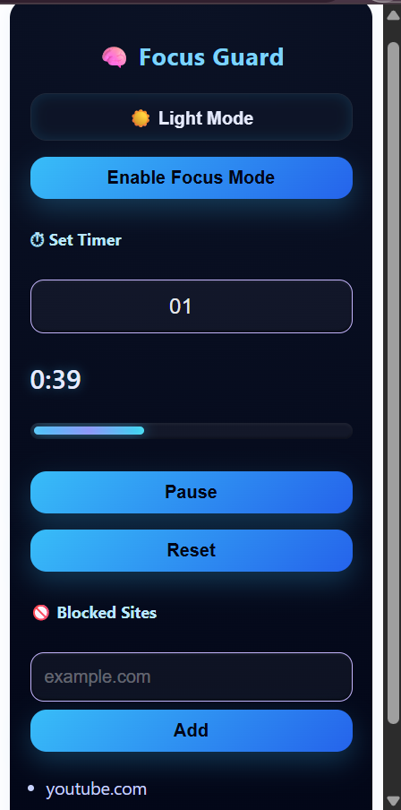
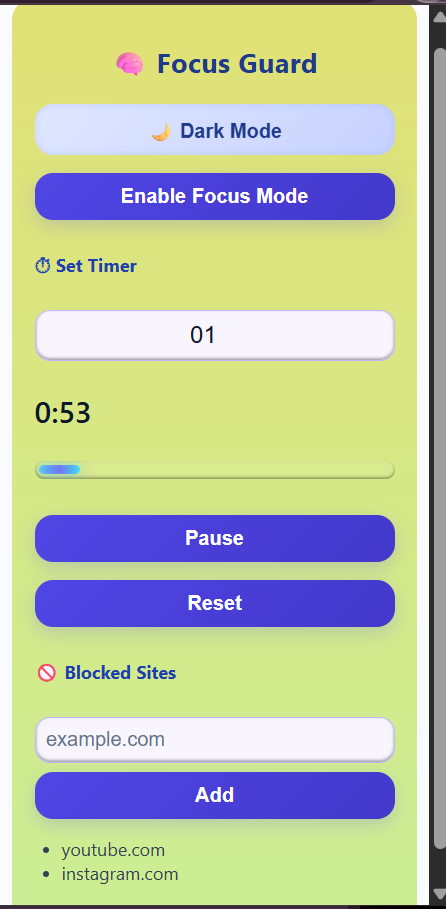

# 🧠 Focus Guard – Productivity Chrome Extension

Focus Guard is a minimal and aesthetic Chrome extension designed to help users
stay focused using Pomodoro technique and website blocking.

## ✨ Features
- ⏱ Custom Pomodoro Timer (Start / Pause / Reset)
- 🚫 Website Blocking
- 🌙 Dark & ☀️ Light Mode
- 🎨 Clean, aesthetic UI
- ⚡ Built with React + Vite

## 🛠 Tech Stack
- React
- Vite
- JavaScript
- Chrome Extensions API
- CSS (Glassmorphism UI)

## 📦 Installation (Developer Mode)
1. Clone the repo
2. Run `npm install`
3. Run `npm run build`
4. Go to `chrome://extensions`
5. Enable Developer Mode
6. Load unpacked → select `dist/`

## 📸 Preview
## 📸 Screenshots
### Dark Mode

### Light Mode

## 👨‍💻 Author
**Abhik Kundu**
## 📜 License
This project is licensed under the MIT License.

